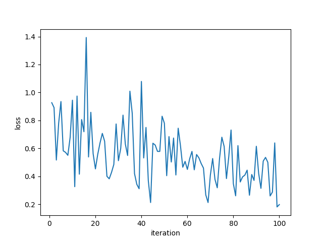

# Facial Reidentification using One Shot Learning - FaceNet Inspired

#### Clone the repository
```
git clone https://github.com/amalshaji/facial-reidentification
```

#### Train the model
1. Place images to be trained as `./folder/<image_classes>`. Images belonging to same class must be under same folder. Sample directory structure,
```
<root_folder>
|----------<class1>
|               <image1_class1>
|               <image2_class1>
|----------<class2>
|               <image1_class2>
|               <image2_class2>
```
2. Run `python train.py --epoch <num_of_epochs> --lr <learning_rate>`

Training parameters such as epochs, batch_size, training and testing directory found in `Config` class

#### Test the model
1. Place the image to be tested as `./folder/<name>`
2. Place the images to be compared with in `./folder/<*.extension>`
3. Run `python evaluate.py --model models/contrastive_model_state_dict_500.pt`
Pretrained model found in models directory. Model size ~ 5MB.      

You can start testing with the pretrained weights. 

#### Results - Contrastive loss after 500 epochs


#### Requirements
```
1. Pytorch
2. PIL
3. OpenCV
4. Numpy
```

